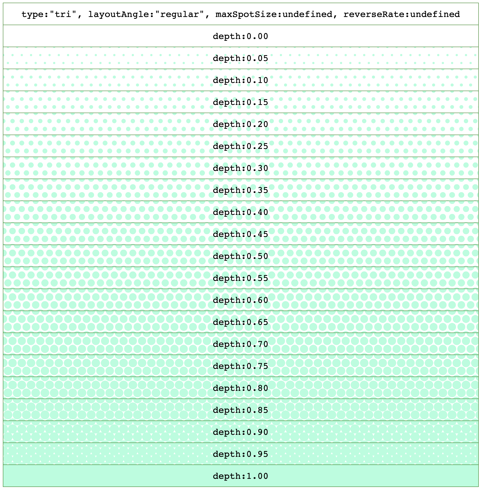
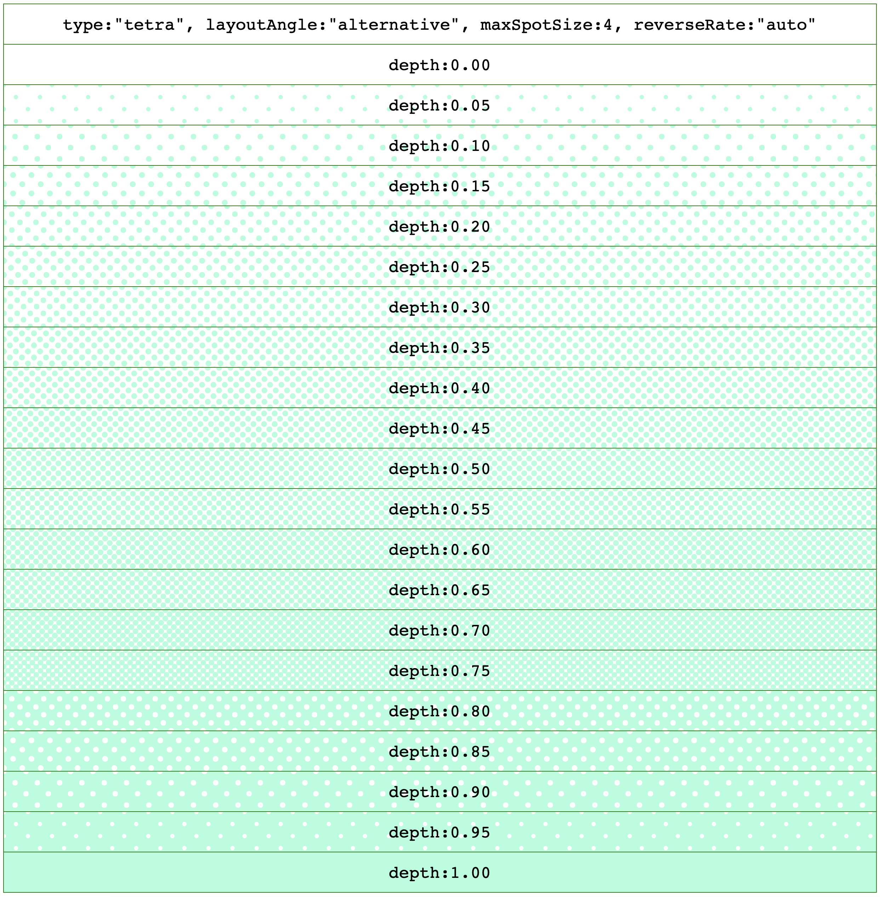

# flounder.style.js

Digital color depth pattern style maker for TypeScript/JavaScript

## Features

This library provides CSS for expressing percentages by area of ​​a color pattern instead of color intensity.

Expressions based on color density can be difficult to recognize, not only for colorblind people, but also for people who are not colorblind. In addition, the expression of subtle hues based on color density is strongly affected by the color development of the display, and in the user environment, the colors may appear quite different from the intended hues.

These problems can be avoided by using color pattern expressions.

## Redering CSS Sample

```css
background-image:
    radial-gradient(circle, rgb(170, 255, 221) 8px, transparent 8px),
    radial-gradient(circle, rgb(170, 255, 221) 8px, transparent 8px),
    radial-gradient(circle, rgb(170, 255, 221) 8px, transparent 8px),
    radial-gradient(circle, rgb(170, 255, 221) 8px, transparent 8px);
background-size: 43.1px 37.32px;
background-position: 0px 0px, 21.55px 0px, 10.77px 18.66px, 32.32px 18.66px;
```

( Line breaks and indentation have been adjusted for ease of viewing, and the CSS that is actually created will not have line breaks and indentation adjusted like this. )

## Redering Samples

See [all samples on the demo page](https://wraith13.github.io/flounder.style.js/demo.html).




## How to install for your project by npm

```sh
npm install @wraith13/flounder.style.js --save
```

## How to use

```typescript
import { flounderStyle } from "flounder.style.js";

// make style list
const data: flounderStyle.Arguments =
{
    type: "tri",
    layoutAngle: "regular",
    foregroundColor: "#AAFFDD",
    spotIntervalSize: 24,
    depth: 0.5,
};
const styleList = flounderStyle.makePatternStyleList(data);

// apply style list
const element = document.getElementById("YOUR-ELEMENT");
flounderStyle.setStyleList(element, styleList);

// get CSS string
console.log(`CSS: ${flounderStyle.styleListToString(styleList)}`);
```

### flounderStyle.Arguments

|key|type|default|description|
|---|---|---|---|
|type|FlounderType|"tri"|see [demo](./demo.html). "tri" or "tetra"|
|layoutAngle|LayoutAngle|"regular"|see [demo](./demo.html). "regular" or "alternative"|
|foregroundColor|Color|`NOT OPTIONAL`|Pattern foreground [CSS Color](https://developer.mozilla.org/en-US/docs/Web/CSS/color_value). foregroundColor must be other than "transparent".|
|backgroundColor|Color|"transparent"|Pattern background [CSS Color](https://developer.mozilla.org/en-US/docs/Web/CSS/color_value). When using reverseRate, backgroundColor must be other than "transparent".|
|spotIntervalSize|number|24|Number of pixels from the center of a spot to the center of the next spot.|
|depth|number|`NOT OPTIONAL`|Must be 0.0 <= depth and depth <= 1.0|
|maxSpotSize|number|`undefined`|If maxSpotSize is specified, instead of increasing the spot size beyond this value, spotIntervalSize will be decreased. Must be 1 <= maxSpotSize and maxSpotSize <= (spotIntervalSize *0.5)|
|reverseRate|number \| "auto" |`undefined`|To avoid pixel collapse, when depth is greater than reverseRate, the foreground color, background color, and depth are reversed. When using reverseRate, backgroundColor must be other than "transparent". Must be 0.0 <= reverseRate and reverseRate <= 1.0 or "auto". If "auto" is specified, it will be set to the same value as the depth at which the spots touch each other.|
|maximumFractionDigits|number|3|The maximum number of digits after the decimal point for numbers used in the generated CSS.|

## Development environment construction

0. Install [Visual Studio Code](https://code.visualstudio.com/) ( Not required, but recommended. )
1. Install [Node.js](https://nodejs.org/)
2. Execute `npm install`.

## How to build

requires: [Node.js](https://nodejs.org/), [TypeScript Compiler](https://www.npmjs.com/package/typescript)

`tsc -P .` or `tsc -P . -w`

## License

[Boost Software License](./LICENSE_1_0.txt)
